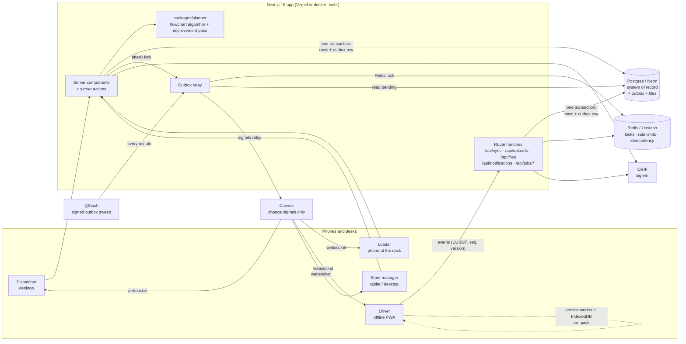

# Architecture

Waypoint Delivery OS is one Next.js 16 app serving four roles (dispatcher, loader, driver, store manager). It runs on a small set of managed services. Each service has one job, and every one has a local stand-in in `docker-compose.yml`, so the whole system runs offline on a laptop.

## Services

| Concern | Cloud | Local (docker compose) | What it does here |
|---|---|---|---|
| App | Next.js 16.3 on Vercel | `web` (standalone build) | Pages, server actions, route handlers, planner |
| System of record | Neon Postgres + Drizzle | `postgres` (pgvector/pg17) | Every business record: orders, plans, trips, stops, PoD, receipts, audit, outbox |
| Realtime | Convex Cloud | `convex` (open-source backend) + `convex-dashboard` | Change signals per channel; screens re-read from Postgres when a signal moves |
| Auth | Clerk (Core 3) | Clerk development instance | Sign-in/up; role and scope live in Postgres, mirrored to Clerk metadata |
| Cache, locks, rate limits | Upstash Redis | `redis` + `redis-rest` (SRH) | Rate limits on sync/uploads, idempotency claims, relay lock |
| Jobs | Upstash QStash | per-request `after()` kick | Signed, retried outbox sweep (`/api/jobs/relay`) |
| Files | Postgres `files` table, or any S3 API when `S3_ENDPOINT` is set | `s3` (SeaweedFS) | Signatures, delivery/damage/shortfall photos |
| Explanations | - | - | Plain-language deferral reasons from deterministic templates (`apps/web/src/lib/explain.ts`); no LLM is called at runtime |

## System diagram



Screens subscribe to Convex channels and re-read Postgres when a signal moves. Without Convex they poll; without Redis or QStash the per-request kick still relays the outbox.

## The one data-flow rule

```
 server action ──► Postgres transaction ─┬─ business rows
                                         └─ outbox row (topic, payload)
                         commit
                           │
       after() kick ───────┤   QStash sweep every minute (signed, retried)
                           ▼
                 relay (Redis lock, oldest first, batches of 100)
                           │ channels: ops · depot:* · trip:* · outlet:* · user:* · role:* · orders
                           ▼
            Convex mutation signals.relay (shared secret, idempotent per outbox id)
                           │ websocket
                           ▼
        subscribed screens re-read their data from Postgres (router.refresh / pack refresh)
```

- **Business data never lives in Convex.** Convex only carries "channel X changed" signals, so a screen can never show a change that did not commit, and nothing private leaves Postgres.
- **A committed change is never lost.** The outbox row stays pending, with its attempt count and last error, until Convex acknowledges it. A missed kick is caught by the next kick or the QStash sweep.
- **Without Convex the app still works.** Screens fall back to polling (`RealtimeRefresh` → `LiveRefresh`), and the notification bell polls every 30 s.

## Planner

`packages/planner` is a TypeScript port of the team's Python planning algorithm (`tools/planner-oracle`). It follows the flowchart in `docs/delivery-planning-flowchart.md`:

- F1 intake and the 16:00 cutoff
- F2–F4 eligibility and hard rules 1–7 (reefer for chilled, van-only outlets, one brand and one district per trip, capacity, the Fresh 03:30–08:00 budget, weekly fuel quota)
- F5–F8 build, repair and schedule
- F9 live re-timing

Golden-file parity tests compare the TS output with the Python oracle on the same inputs (`packages/planner/test/parity.test.ts`), and the 2B allocation passes the organisers' `check_allocation.py`. Plans are stored as trips and stops. Every manual edit re-validates the vehicle-day with the same rules before it is saved.

**Improvement pass** (`packages/planner/src/optimize.ts`). Auto-plan runs the flowchart algorithm, which stays identical to the oracle, then a deterministic local search on its result:
- fit deferred orders into any trip that now has room;
- ejection chains: move a lighter order to another vehicle so a deferred one takes its place;
- freeing a capable vehicle: hand one of its whole trips to a less specialised vehicle, so a reefer or van can take the order that needs it;
- merging same-brand, same-district trips to save trips and fuel.

It only accepts a change that serves more priority weight, or the same weight in fewer trips. It never drops an order the baseline served, and every changed vehicle-day is re-checked with the full rule set. The board shows each change in plain language. On the booklet days it removes 2–5 trips on normal days and serves 1–2 more orders on constrained ones, in 1–4 ms.

**Fairness.** An outlet skipped on the previous run gets a large priority boost. If it is deferred again anyway, it is flagged red in deferral review and on the tower, and publishing is blocked until the dispatcher records why.

**Overrides.** The dispatcher can accept a timing or fuel overrun with a written reason: a late delivery window, the Fresh or day time budget, or the fuel quota. The reason is audited and shown at publish. Physical rules can never be overridden: vehicle type, weight, volume, one brand and district per trip, and two trips a day.

**CI parity without the confidential data.** `tools/planner-oracle/export_synthetic.py` invents a two-depot operation with the same file layout. CI runs the Python oracle on it, fails if the committed fixtures in `packages/planner/test/synthetic/` differ, and then checks two things: the TypeScript planner reproduces them exactly, and the optimiser keeps every guarantee (`.github/workflows/ci.yml`).

## Offline driver app

The driver app keeps working with no signal:

- **Run pack.** `/drive` builds a run pack (trips, stops, windows, docks, load list, conflicts, dispatcher notices). The service worker (Serwist) caches the app shell, and IndexedDB (Dexie) stores the pack.
- **Recording.** Every driver action becomes an event in a local outbox, with a UUIDv7 id, a per-device sequence number, the business-clock minute, and the stop version the phone last saw.
- **Sync.** `/api/sync` applies events in sequence. The event id makes replays `DUPLICATE`; the rate limit is enforced through Redis.
- **Conflicts.** If the dispatcher changed a stop while the phone was offline (version mismatch), the driver's fact is still applied as recorded, and a conflict opens for DG-02 reconciliation.

## Business clock

The seeded operation is Tue 23 Dec 2025, so the app runs on a demo clock stored in `app_settings`. The `/demo` panel sets it, and a fleet simulator advances every truck not driven by a signed-in driver along its plan, with road-disruption drift. Every timestamp a user sees comes from this clock (`businessDate()`).

**Demo reset without the dataset.** Seeding from the CSVs also copies every operational table into a `demo_baseline` schema in the same database. "Reset demo data" on `/demo` restores from that copy in one transaction, so a hosted deployment can be reset without shipping the confidential CSVs.

## Security

- Every page, action and route handler calls `requireUser(roles)` or `userForApi(roles)`. Authorization reads role and scope from Postgres; Clerk metadata is only a mirror for the UI.
- Store managers are scoped to one outlet, loaders and drivers to a depot, and drivers to their vehicle's stops.
- Uploads are type-checked, size-limited and rate-limited. Files are served only to signed-in users.
- QStash jobs verify the signature (current and next signing keys). The Convex relay mutation requires a server-only secret.
- Manual overrides (deferral decisions, dock decisions, conflict resolutions, access approvals) are written to `audit_log` with who, what and why.
