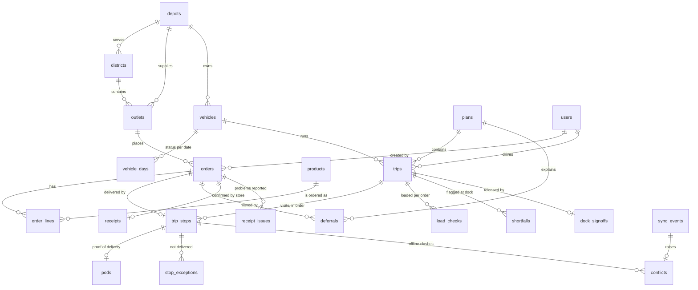

# Data model

Postgres (Neon in the cloud, `postgres` in docker compose) is the system of record. The schema is in `packages/db/src/schema.ts` (Drizzle) and the migrations are in `packages/db/drizzle/`. There are 33 tables in six groups.

## Groups

| Group | Tables | Notes |
|---|---|---|
| Reference (seeded from the booklet CSVs) | `depots`, `districts`, `outlets`, `vehicles`, `service_allowances`, `calendar_days`, `traffic_speed`, `road_conditions`, `products` | Read by the planner through `loadReference()`; `products` is a catalogue synthesised so orders have lines |
| People | `users` | Role, status (pending → active / rejected / disabled), scope (depot, outlet, vehicle), requested role, approver |
| Ordering | `orders`, `order_lines` | `run_date` comes from the planner's intake (F1: the 16:00 cutoff); `deferred_yesterday` and `days_since_last_served` feed fairness |
| Planning | `plans`, `trips`, `trip_stops`, `deferrals`, `vehicle_days`, `fuel_ledger` | `trip_stops.version` rises on every dispatcher change and is the basis of offline conflict detection; every deferral stores its kind, reason code and plain-language explanation |
| Dock and road | `load_checks`, `shortfalls`, `dock_signoffs`, `pods`, `stop_exceptions`, `receipts`, `receipt_issues` | The PoD stores recorded times, units handed over, the recipient and object-storage keys for the signature and photo |
| Communication | `messages`, `notifications` | Notifications are addressed to a user, a role (optionally a depot) or an outlet |
| Capacity | `forecasts` | Weekly m³ per depot × brand × ISO week; `source` is `baseline` (seeded) or `datathon` (Task 2A upload) |
| Sync, audit, realtime | `sync_events`, `conflicts`, `audit_log`, `outbox`, `app_settings` | `sync_events.event_id` is the client UUIDv7 idempotency key; `outbox` is the transactional outbox relayed to Convex; `app_settings` holds the demo clock |

## Invariants

- Each order is on at most one stop of one published plan per run date. A deferred order carries a `deferrals` row with its reason and moves to the next run with priority.
- A trip has one brand and one district (booklet rule 3), and a chilled order is only on a reefer (rule 2). These rules and rules 1 and 4–7 are checked by the planner on every save, not only by auto-plan.
- Driver facts are never overwritten: a PoD recorded offline is kept with its recorded times, even when the stop changed meanwhile. The clash becomes a `conflicts` row.
- Every business write that others must see also inserts an `outbox` row in the same transaction.
