# Delivery Planning and Route-Leg Scheduling — Complete Flowchart

Waypoint Group · Tech-Triathlon 2026 · validated against the supplied datasets on 2026-09-26

This document is the complete decision logic for turning confirmed orders into vehicle trips, timed route legs, deferrals and live ETAs. Every parameter comes from the dataset unless it is marked **ASSUMPTION**. Every test case uses real rows from the CSVs. The Python implementation in `delivery_planning_algorithm/` follows these charts node by node, and all 50 of its tests pass: 38 test cases, 6 scenario runs and 6 validations against the data. The S1 allocation it produces passes the organisers' `check_allocation.py`.

**How to test by hand:** pick a test case in section 14, start at the chart it names, follow the nodes with the listed inputs, and compare your result with the expected output. Section 15 walks through five cases step by step. Section 13 lists the reference values you need, so you never have to open the CSVs.

---

## Contents
1. Legend and modes
2. Parameters (from the dataset)
3. Master flowchart — one planning day
4. F1 Order intake and cutoff
5. F2 Eligibility (order × vehicle)
6. F3 Priority weight and class
7. F4 Trip construction
8. F5 Vehicle-day feasibility check
9. F6 Route-leg scheduling
10. F7 Departure time
11. F8 Repair and deferral classification
12. F9 Live operations and offline sync
13. Reference values for manual testing
14. Validation against the dataset, scenarios and test cases
15. Manual walkthroughs

---

## 1. Legend and modes

| Shape | Meaning |
|---|---|
| `([ ... ])` rounded | start or end |
| `[ ... ]` rectangle | action |
| `{ ... }` diamond | decision |
| `[[ ... ]]` double box | call another chart (F1–F9) |

| Mode | Used for | Checks |
|---|---|---|
| **2B** | Datathon Task 2B, the organisers' checker | Booklet rules 1–7 only (capacity, reefer, van, depot, brand + district per trip, whole orders, ≤ 2 trips, 270 / 480-minute budgets) |
| **LIVE** | Hackathon system | Rules 1–7 **plus** clock-time delivery windows, trip-2 timing, weekly fuel quota, late-risk flags |

| Time model | Travel per leg | Service per stop | Used for |
|---|---|---|---|
| **PLANNED** | Booklet free-flow minutes | Allowance table | Hard feasibility (a plan must pass) |
| **EXPECTED** | Free-flow × traffic × road disruption, + 8 min depot delay | Fitted service formula | Late-risk flags, departure pull-back, store ETAs, live re-scheduling |

---

## 2. Parameters (from the dataset)

| ID | Parameter | Value | Source and evidence |
|---|---|---|---|
| P01 | Earliest Fresh departure | **02:00** | Minimum planned departure in `route_legs_train.csv`; 12.4% of Fresh routes leave exactly 02:00 (Badulla 62%, Puttalam 52%) |
| P02 | Earliest Style/Tech departure | **07:30** | Minimum planned departure of Style/Tech routes |
| P03 | Fresh time budget per vehicle | **270 min** | Booklet rule 7; history: 18,777 vehicle-days, 0 above 270, maximum exactly 270 |
| P04 | Style + Tech budget per vehicle | **480 min** | Booklet rule 7; history: 0 violations |
| P05 | Trips per vehicle per day | **≤ 2** | Booklet; history maximum 2 |
| P06 | Trip minutes (budget formula) | outbound + (stops − 1) × inter-stop + Σ allowance | Booklet; identical to `check_allocation.py` |
| P07 | Planned leg minutes | round(km ÷ district free-flow km/h × 60); first leg = `depot_to_district_freeflow_min`, later legs = `inter_stop_freeflow_min` | Matches 91,894 of 91,894 planned legs |
| P08 | Planned service | `service_allowance_min` (brand, dock) | Matches 100% of planned stop dwells |
| P09 | Stop order | Window close ascending, then window open ascending, then outlet ID | 98.5% of 25,198 historical routes are close-ascending; tie order in the data is inconsistent (nearest-next only 69%), so the tie-break is our rule |
| P10 | Early arrival | Wait until the window opens | Booklet; 4.4% of actual arrivals are early. The dataset's planned times skip this wait on 14.1% of legs, our PLANNED mode adds it |
| P11 | Late | Arrival after window close (mall window = outlet window) | Booklet definition |
| P12 | Depot departure delay (EXPECTED) | **8 min** | Actual − planned first departure: mean 7.7, median 6, p90 15; same for all brands and both depots |
| P13 | Travel multiplier (EXPECTED) | planned × 100 ÷ `speed_index`(district, hour, monsoon) × 100 ÷ `disruption_index`(district, date) × 1.00 | Factor is exactly 1.000 when the hour is the real departure hour; leg MAE 7.5 min on the district travel minutes vs 11.8 for plain planned minutes |
| P14 | Service formula (EXPECTED) | base(brand, dock) + u × units + f × festival_ramp + p × payday + m × monsoon, minimum 3 | Fitted on 2024-01 → 2025-12; MAE 5.7 min vs 7.1 for the allowance table (2026 hold-out). Coefficients in section 13 |
| P15 | Late-risk margin | **20 min** before window close | 2026 hold-out: catches 85% of real late arrivals, precision 0.62, 18.3% of stops flagged; margin 0 → 70% / 0.79; margin 10 → 78% / 0.71; margin 30 → 89% / 0.54 |
| P16 | Reload between a vehicle's trips | **30 min** — ASSUMPTION | Cannot be measured: in history, trip 2 is planned a median 73 min *before* trip 1 could have returned |
| P17 | Litres per trip | (2 × `depot_to_district_km` + (stops − 1) × `inter_stop_km`) ÷ `km_per_l` | Return leg included; weekly quota from `vehicles.csv` (history: median 34% used, VEH046 94%) |
| P18 | Order cutoff | 16:00 on the operating day before the run | Booklet; operating days from `calendar.is_operating` (Sundays and holidays closed) |
| P19 | Priority weight w | 1000 × deferred_yesterday + 20 × days_since_last_served + 10 × chilled + m³ | Policy: no repeat deferral ≫ days unserved ≫ perishable ≫ volume |
| P20 | Class order | 0 van-only chilled → 1 chilled → 2 van-only ambient → 3 everything else | Scarcest resource first |
| P21 | Vehicle capability cost | reefer +2, van +1 | Prefer the least capable vehicle that works |
| P22 | Not-departed exception | planned departure + 15 min | p90 of depot departure delay |
| P23 | Long-stop exception | expected service + 10 min, clock starts at the later of arrival and window open | p90 of (actual − expected service) = 9.7 min |

---

## 3. Master flowchart — one planning day

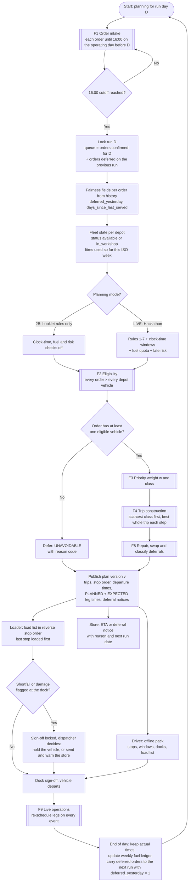

---

## 4. F1 Order intake and cutoff

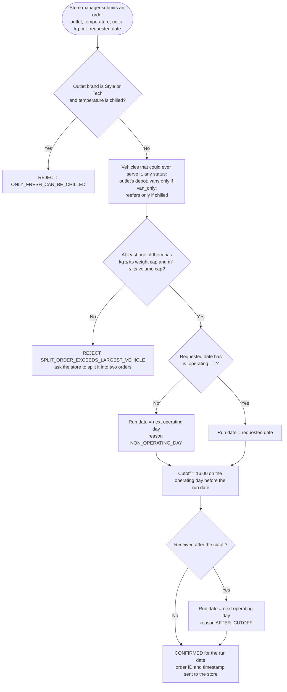

A Fresh outlet may place a dry and a chilled order for the same day. They stay separate orders because only the chilled one needs a reefer.

---

## 5. F2 Eligibility (order × vehicle)

Checks run in this order; the first failure is the recorded code.

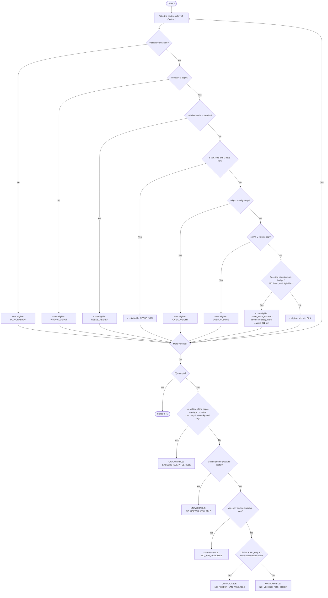

---

## 6. F3 Priority weight and class

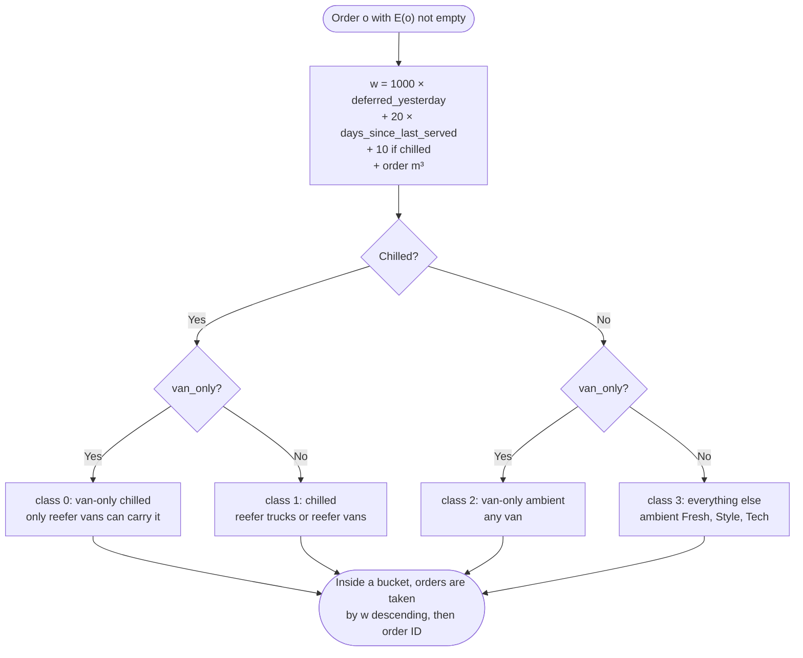

---

## 7. F4 Trip construction

Commits the best whole trip at each step. A bucket is one brand + one district (booklet rule 1).

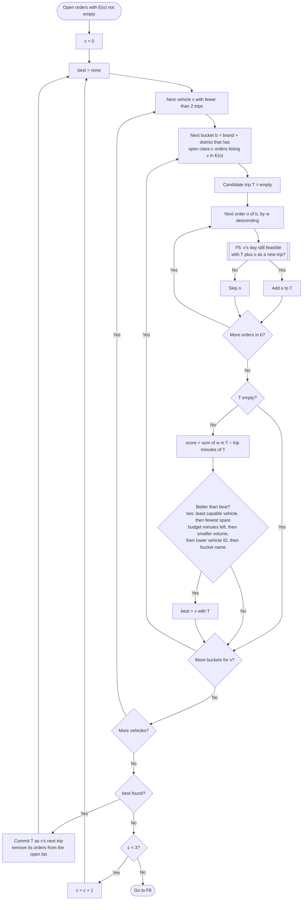

---

## 8. F5 Vehicle-day feasibility check

Checks one vehicle's whole day. Used by F4, F8, and every manual edit the dispatcher makes.

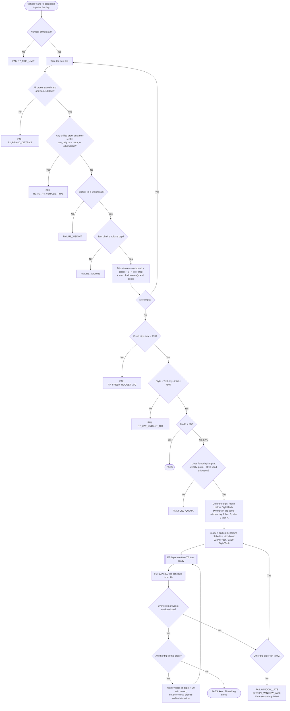

---

## 9. F6 Route-leg scheduling

Produces the timed leg table for one trip, in either time model.

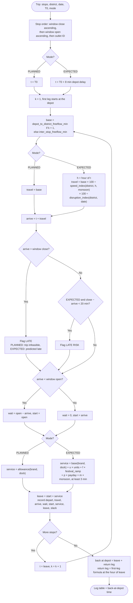

---

## 10. F7 Departure time

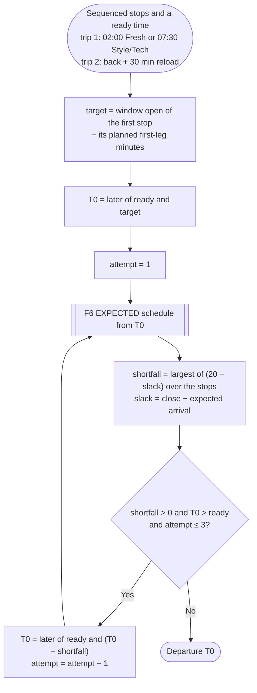

The vehicle leaves so it reaches the first stop as its window opens. It leaves earlier only when the expected schedule would put a stop inside the 20-minute risk margin.

---

## 11. F8 Repair and deferral classification

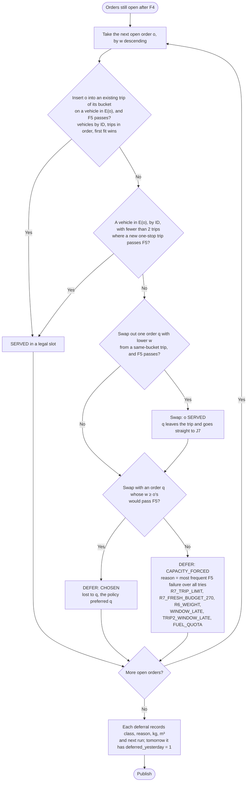

---

## 12. F9 Live operations and offline sync

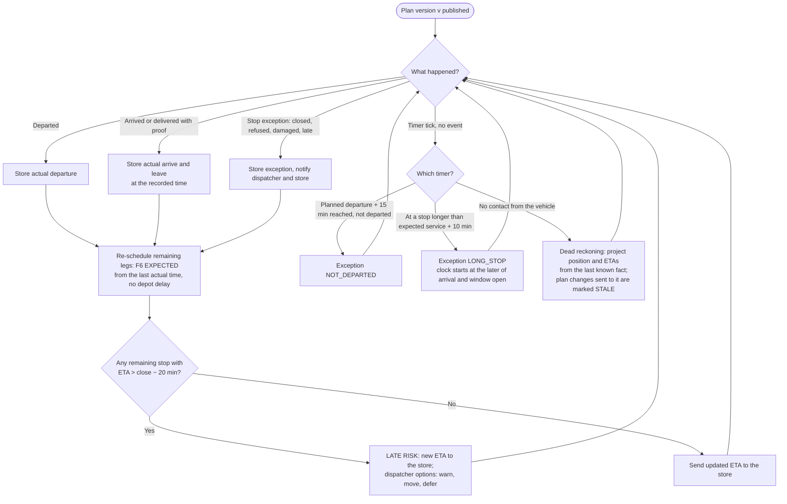

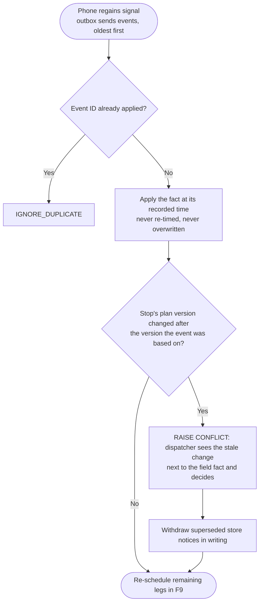

---

## 13. Reference values for manual testing

**District travel** (`district_travel.csv`)

| District | Depot | Outbound min | Inter-stop min | Depot km | Inter-stop km |
|---|---|---|---|---|---|
| Colombo | Peliyagoda | 24 | 8 | 12 | 4 |
| Gampaha | Peliyagoda | 37 | 9 | 28 | 7 |
| Kalutara | Peliyagoda | 64 | 12 | 48 | 9 |
| Galle | Peliyagoda | 103 | 9 | 120 | 10 |
| Matara | Peliyagoda | 137 | 10 | 160 | 12 |
| Kurunegala | Peliyagoda | 127 | 19 | 95 | 14 |
| Puttalam | Peliyagoda | 173 | 24 | 130 | 18 |
| Kandy | Kandy | 16 | 6 | 8 | 3 |
| Matale | Kandy | 35 | 11 | 26 | 8 |
| Nuwara Eliya | Kandy | 111 | 20 | 78 | 14 |
| Badulla | Kandy | 186 | 23 | 130 | 16 |
| Kegalle | Kandy | 53 | 13 | 40 | 10 |

**Service allowance, minutes** (`service_allowance.csv`)

| Brand | rear_dock | street | mall_bay |
|---|---|---|---|
| Fresh | 15 | 16 | 18 |
| Style | 38 | 46 | 59 |
| Tech | 43 | 55 | 55 |

**Expected service formula** (P14): minutes = base + u × units + f × festival_ramp + p × payday + m × monsoon, at least 3

| Brand | base rear_dock | base street | base mall_bay | u per unit | f | p | m |
|---|---|---|---|---|---|---|---|
| Fresh | 3.9 | 7.5 | 7.5 | 0.178 | 13.9 | 5.1 | 3.1 |
| Style | −4.0 | 14.6 | 31.0 | 0.724 | 43.8 | 14.2 | 7.7 |
| Tech | 5.7 | 22.7 | 34.0 | 7.605 | 43.2 | 16.7 | 6.9 |

**Vehicles used in the tests** (`vehicles.csv`)

| Vehicle | Depot | Type | Temp | kg cap | m³ cap | km/L | Weekly quota L |
|---|---|---|---|---|---|---|---|
| VEH003 | Peliyagoda | truck | reefer | 5,510 | 26.4 | 4.7 | 480 |
| VEH006 | Peliyagoda | truck | reefer | 6,840 | 33.4 | 4.4 | 380 |
| VEH007 | Peliyagoda | truck | reefer | 3,610 | 19.4 | 6.4 | 590 |
| VEH008 | Peliyagoda | truck | ambient | 3,800 | 22.0 | 7.1 | 460 |
| VEH009 | Peliyagoda | truck | ambient | 5,800 | 30.0 | 5.2 | 440 |
| VEH014 | Peliyagoda | truck | ambient | 7,200 | 38.0 | 4.9 | 530 |
| VEH015 | Peliyagoda | truck | ambient | 3,800 | 22.0 | 7.1 | 560 |
| VEH035 | Peliyagoda | van | reefer | 1,040 | 7.0 | 10.3 | 480 |
| VEH036 | Peliyagoda | van | reefer | 1,040 | 7.0 | 10.3 | 480 |
| VEH037 | Peliyagoda | van | ambient | 1,100 | 8.0 | 11.5 | 340 |
| VEH038 | Peliyagoda | van | ambient | 1,200 | 9.0 | 10.8 | 620 |
| VEH040 | Kandy | truck | reefer | 5,510 | 26.4 | 4.7 | 380 |
| VEH046 | Kandy | truck | ambient | 3,800 | 22.0 | 7.1 | 350 |
| VEH057 | Kandy | van | reefer | 1,040 | 7.0 | 10.3 | 450 |

**Outlets used in the tests** (`outlets.csv`, window = open–close)

| Outlet | Brand · district | Dock · access | Window |
|---|---|---|---|
| OUT001 / OUT003 | Fresh · Colombo | street · van_only | 05:00–07:30 |
| OUT002 | Fresh · Colombo | street · van_only | 05:30–08:00 |
| OUT004 | Fresh · Colombo | street · normal | 05:30–08:00 |
| OUT006 | Fresh · Colombo | street · normal | 03:00–08:00 |
| OUT016 | Style · Colombo | mall_bay · mall_dock | 09:00–11:00 |
| OUT018 | Style · Colombo | mall_bay · mall_dock | 10:30–12:30 |
| OUT025 / OUT026 / OUT027 | Fresh · Gampaha | rear / rear / street | 05:30–08:00 / 03:00–08:00 / 05:00–07:30 |
| OUT032 | Fresh · Gampaha | rear_dock | 04:00–07:45 |
| OUT050 / OUT051 / OUT052 / OUT055 | Fresh · Galle | rear / street / street / street | 05:30–08:00 / 03:00–08:00 / 05:00–07:30 / 05:00–07:30 |
| OUT073 / OUT074 / OUT075 | Fresh · Puttalam | rear_dock | 03:00–08:00 / 05:30–08:00 / 03:00–08:00 |
| OUT104 / OUT105 / OUT106 / OUT107 / OUT108 | Fresh · Nuwara Eliya | rear_dock | 03:00–08:00 / 05:00–07:30 / 05:30–08:00 / 03:00–08:00 / 04:00–07:45 |
| OUT110 / OUT111 / OUT112 | Fresh · Badulla | rear_dock | 03:00–08:00 / 03:00–08:00 / 04:00–07:45 |

**Lookup values used in the EXPECTED-mode walkthroughs**

| Case | Values |
|---|---|
| 23 Dec 2025 | festival_ramp 0.8, not payday, monsoon 0; disruption Nuwara Eliya 99, Galle 70 |
| Nuwara Eliya speed_index (monsoon 0) | hour 3 = 89, hour 6 = 71, hour 7 = 59, hour 8 = 57 |
| Galle speed_index (monsoon 0) | hour 5 = 96, hour 8 = 78, hour 9 = 85 |
| S1 peak day context | festival_ramp 0.3 (7 days before a festival), not payday, monsoon 0, disruption 100 |

---

## 14. Validation against the dataset, scenarios and test cases

### 14.1 Validation of the flowchart logic against the data as it is

| ID | What was checked | Result |
|---|---|---|
| V1 | P07 planned leg minutes = round(km ÷ free-flow km/h × 60) | 91,894 of 91,894 legs match |
| V2 | P08 planned dwell = allowance(brand, dock) | 100% of 66,696 stop-to-stop legs match; the dataset skips the early-arrival wait on 14.1% of legs, F6 adds it |
| V3 | P09 stop order by window close | 98.5% of 25,198 routes; all 369 exceptions are Style/Tech mall routes, some planned late (R000144: 11:28 vs 11:00 close) — F6 fixes this (TC-22) |
| V4 | Booklet rules 1–7 on all 25,198 historical routes | 0 violations: capacity, reefer, van, depot, trips ≤ 2, Fresh ≤ 270 (maximum exactly 270), Style/Tech ≤ 480 |
| V5 | P13 expected travel per leg (district travel minutes, real departure hour) | MAE 7.5 min vs 11.8 min for planned minutes |
| V6 | P14 expected service per stop | MAE 5.7 min vs 7.1 min for the allowance table |
| V7 | F6 EXPECTED full-route replay, 2026 hold-out (5,461 stops) | Arrival MAE 19.3 min vs 38.7 min for the dataset's plan; the 20-min risk flag catches 85% of real late arrivals (precision 0.62), the dataset's plan catches 4% |
| V8 | F5 LIVE clock rule on historical days with two Fresh trips per vehicle (sample of 600 of 3,145) | 490 (82%) are physically impossible: trip 2 would arrive after the window closed; all 600 pass in 2B mode |
| V9 | F4 + F8 on S1 vs an exact optimisation model (MILP, HiGHS) | Both serve 77/85 and 19/26 chilled in 2B mode; heuristic under 1 s vs 120 s; official checker passes |

### 14.2 Full-day simulation scenarios (real dates, all vehicles available unless stated)

| ID | Scenario | Input | History (as recorded) | Flowchart result (LIVE) |
|---|---|---|---|---|
| SC-1a | Normal day | 10 Sep 2025, Peliyagoda: 81 orders (28 chilled, 5 van-only, 2 mall), no festival, payday or monsoon | 22 routes, 17 vehicles, 0 deferred, 7 late stops | 81/81 served, 22 trips on 18 vehicles, 4 vehicles with 2 trips, 8 stops predicted late, 507 L fuel |
| SC-1b | Normal day | 10 Sep 2025, Kandy: 57 orders (23 chilled, 14 van-only) | 17 routes, 12 vehicles, 0 deferred, 8 late | 57/57 served, 17 trips on 15 vehicles, 4 predicted late |
| SC-2 | Festival peak | 23 Dec 2025, Peliyagoda: 90 orders (39 chilled), festival_ramp 0.8 | 22 routes, 18 vehicles, **11 chilled deferred**, 21 late | **89/90 served**, 22 trips on 19 vehicles; OUT069 Kurunegala chilled CHOSEN (lost to ORD0085940); 24 late-risk stops flagged |
| SC-2b | Festival peak, reefer van down | Same day, VEH036 in workshop | 11 deferred | 87/90 served; OUT073 and OUT075 Puttalam chilled CAPACITY_FORCED (R7_FRESH_BUDGET_270), OUT069 CHOSEN |
| SC-3 | Van-only pressure | 23 Dec 2025, Kandy: 51 orders, 13 van-only, 4 vans | 14 routes, 11 vehicles, 0 deferred, 13 late | 51/51 served, 14 trips on 12 vehicles, 12 late-risk flags |
| SC-4 | Peak day with workshop | S1: 85 orders, 28 vehicles available, 10 in workshop | — | 2B: 77/85, 19/26 chilled, passes checker. LIVE: 74/85, 16/26 chilled (clock time removes 3 second trips) |
| SC-5 | Worst lateness day in history | 15 Mar 2025, monsoon; disruption Galle 47, Matara 48, Kalutara 54, Colombo 61 | 70 of 138 stops late; the plan warned of 2 | Evening-before EXPECTED flags catch **64 of 70** late stops, 7 false alarms |
| SC-6 | Dead zone, live | R023442, VEH040, Kandy → Nuwara Eliya, no signal 06:01–08:58 | OUT106 arrived 08:19, OUT107 09:07 (both late) | See TC-34: projection while silent, conflict on reconnect, OUT107 ETA 09:19 after sync |

### 14.3 Test cases

Every row is an automated test in `delivery_planning_algorithm/tests/test_cases.py` (run `pytest -k tc25` for one case). ✔ = the expected value was computed by hand; ◆ = it was computed by the implementation and traced in section 15. Tick the last column as you test by hand.

| TC | Chart and nodes | Input (real data) | Expected output | Check | Manual result |
|---|---|---|---|---|---|
| TC-01 | F1 A1→A4→A6→A8→A10→A12 | OUT006 dry 601.7 kg / 3.428 m³ for Tue 2025-12-23, received Mon 22 Dec 14:20 | CONFIRMED for 2025-12-23, ON_TIME | ✔ | ☐ |
| TC-02 | F1 A10→A11 | Same order received Mon 22 Dec 16:05 | CONFIRMED for 2025-12-24, AFTER_CUTOFF | ✔ | ☐ |
| TC-03 | F1 A6→A7 | Requested Mon 2026-04-13 (New Year; 14 Apr also closed), received Fri 10 Apr 10:00 | CONFIRMED for 2026-04-15, NON_OPERATING_DAY (cutoff Sat 11 Apr 16:00) | ✔ | ☐ |
| TC-04 | F1 A9→A10→A11 | For Mon 2025-12-22, received Sat 20 Dec 17:00 | CONFIRMED for Tue 2025-12-23, AFTER_CUTOFF (Sunday closed) | ✔ | ☐ |
| TC-05 | F1 A1→A2 | OUT015 (Style) orders chilled | REJECT ONLY_FRESH_CAN_BE_CHILLED | ✔ | ☐ |
| TC-06 | F1 A4→A5 | S1-078: OUT070 Style 2,561.6 kg / 40.66 m³ (largest truck 38 m³) | REJECT SPLIT_ORDER_EXCEEDS_LARGEST_VEHICLE | ✔ | ☐ |
| TC-07 | F1 A3→A5 | OUT001 (van_only) chilled 1,100 kg (reefer van cap 1,040 kg) | REJECT SPLIT_ORDER_EXCEEDS_LARGEST_VEHICLE | ✔ | ☐ |
| TC-08 | F2 B3, B4, BOK | S1-001 (OUT001, chilled, van_only) vs VEH037 / VEH003 / VEH036 | NEEDS_REEFER / NEEDS_VAN / eligible | ✔ | ☐ |
| TC-09 | F2 B2 | S1-001 vs VEH057 (Kandy reefer van) | WRONG_DEPOT | ✔ | ☐ |
| TC-10 | F2 B1 | S1-001 vs VEH035 on the S1 day | IN_WORKSHOP | ✔ | ☐ |
| TC-11 | F2 B5 | Tech OUT064 order of 23 Dec 2025, 1,771.0 kg, vs VEH038 van (1,200 kg) | OVER_WEIGHT | ✔ | ☐ |
| TC-12 | F2 B6 | S1-061 Style 799 kg / 11.822 m³ vs VEH038 (9 m³) | OVER_VOLUME | ✔ | ☐ |
| TC-13 | F2 B7 | Worst one-stop trip: Badulla rear dock | 186 + 15 = 201 ≤ 270, eligible | ✔ | ☐ |
| TC-14 | F2 R1–R4 | (a) S1-078; (b) S1-001 with VEH036 also in workshop; (c) S1-012 with all 4 S1 reefers in workshop | (a) EXCEEDS_EVERY_VEHICLE (b) NO_REEFER_VAN_AVAILABLE (c) NO_REEFER_AVAILABLE | ✔ | ☐ |
| TC-15 | F3 C1 | S1-083 (deferred yesterday, 5 days, chilled, 8.659 m³); S1-001 (0, 2 days, chilled, 2.445); S1-000 (0, 1 day, ambient, 0.5) | w = 1118.659; 52.445; 20.5 | ✔ | ☐ |
| TC-16 | F5 E7→E9, E1 | Booklet example on VEH014: Gampaha OUT025 + OUT026 (rear) + OUT027 (street); Colombo OUT004, OUT006, OUT007, OUT014 (street); then a third trip | 101 + 112 = 213 ≤ 270 PASS; third trip FAIL R7_TRIP_LIMIT | ✔ | ☐ |
| TC-17 | F5 E9 | (a) Puttalam OUT073, OUT074, OUT075; (b) add a second OUT073 order on VEH003; (c) Badulla OUT110, OUT111, OUT112 | (a) 173 + 2×24 + 3×15 = 266; (b) 305 → FAIL R7_FRESH_BUDGET_270; (c) 277 → FAIL R7_FRESH_BUDGET_270 (Badulla fits at most 2 stops) | ✔ | ☐ |
| TC-18 | F5 E5, E6 | Colombo Tech S1-023 + 024 + 025 (4,158.1 kg / 12.78 m³) on VEH008, then VEH009; Galle Style S1-060 + 061 (1,315.7 kg / 19.68 m³) on VEH015, then VEH037; two Style orders 280 kg / 4.5 m³ each on VEH037 | VEH008 FAIL R6_WEIGHT; VEH009 PASS; VEH015 PASS (volume-bound, 89%); VEH037 FAIL R6_WEIGHT (weight is checked first); pair FAIL R6_VOLUME | ✔ | ☐ |
| TC-19 | F5 E3 | Fresh S1-000 and Tech S1-024 on one trip | FAIL R1_BRAND_DISTRICT | ✔ | ☐ |
| TC-20 | F6 PLANNED | R023442 (VEH040, Nuwara Eliya, 23 Dec 2025) from 03:28 in the recorded stop order | Arrivals 05:19, 05:54, 06:29, 07:04, 07:39; back 09:45; 266 trip minutes. F6 own order: OUT105, OUT108, OUT104, OUT107, OUT106 | ✔ | ☐ |
| TC-21 | F6 G15→G16 | OUT001, depart 04:00 | Arrive 04:24, wait 36, start 05:00, leave 05:16 | ✔ | ☐ |
| TC-22 | F6 + F7 | R000144 (VEH008, Colombo Style, 4 Jan 2024): dataset visits OUT018 then OUT016 | Dataset: OUT016 at 11:28, late. Flowchart: OUT016 then OUT018, T0 08:36, arrivals 09:00 and 10:07 (wait 23), no late | ◆ | ☐ |
| TC-23 | F6 EXPECTED | R023442 from 03:28, 23 Dec 2025 context | Expected arrivals 05:42, 06:32, 07:27, 08:27, 09:24 → ok, ok, ok, LATE, LATE. Actual 05:38, 06:10, 06:46, 08:19 (late), 09:07 (late) | ◆ | ☐ |
| TC-24 | F7 | S1-007 (OUT004 Colombo, opens 05:30), ready 02:00 | target 05:06; T0 05:06 (no pull-back needed) | ◆ | ☐ |
| TC-25 | F5 E13–E20 + F7 | VEH003 with Puttalam S1-083 and Colombo S1-007 | 2B: 188 + 40 = 228 ≤ 270, PASS. LIVE: FAIL TRIP2_WINDOW_LATE (both trip orders late) | ✔ | ☐ |
| TC-26 | F5 + F7 | VEH003 with Colombo S1-007 then Gampaha S1-038 | LIVE PASS: T0 05:06 and 06:40; OUT032 arrival 07:17 ≤ 07:45 | ◆ | ☐ |
| TC-27 | F5 E12 | VEH046 (7.1 km/L, quota 350 L) with 330 L used this week: (a) Badulla OUT110 + OUT111; (b) Kandy OUT084, OUT085, OUT086 | (a) (2×130 + 16) ÷ 7.1 = 38.9 L > 20 → FAIL FUEL_QUOTA; (b) (16 + 2×3) ÷ 7.1 = 3.1 L → PASS | ✔ | ☐ |
| TC-28 | F4 + F8 + checker | S1 full day | 2B: 77/85 served, 19/26 chilled, 28 trips, `check_allocation.py` PASSED. LIVE: 74/85, 16/26 chilled | ✔ | ☐ |
| TC-29 | F8 J7, J9 | S1 deferrals | 2B: S1-078 UNAVOIDABLE; S1-056, 058 (Galle), 064, 067 (Matara), 071, 073, 075 (Kurunegala) CAPACITY_FORCED R7_TRIP_LIMIT. LIVE adds S1-046, 051 (Kalutara) CAPACITY_FORCED and S1-033 CHOSEN (lost to S1-041, a repeat-deferral) | ◆ | ☐ |
| TC-30 | F3 + F8 | S1-083 (deferred yesterday, 5 days unserved) | Served in both modes | ✔ | ☐ |
| TC-31 | F4 class 0 + F5 | Van-only chilled S1-001, 003, 005 = 1,095.7 kg (> VEH036's 1,040 kg) | VEH036 trip 1 = S1-001 + S1-005 (T0 04:36, arrive 05:00 and 05:24, back 06:04); trip 2 = S1-003 (T0 06:34, arrive 06:58) | ◆ | ☐ |
| TC-32 | F9 K5→K10, K6→K8 | R023443 VEH004, Galle, 23 Dec: planned 04:26, departed 05:09 | Not at 04:40; NOT_DEPARTED at 04:41; ETAs 07:42, 08:27, 09:10, 09:54, all LATE (Galle disruption 70). Actual 07:17 (on time), 07:57, 08:38, 09:08 (late): 3 of 3 real lates flagged, 1 false alarm | ✔/◆ | ☐ |
| TC-33 | F9 K11 | R023464 VEH027 at OUT027: arrived 04:42, window opens 05:00 | Service clock starts 05:00; expected service 31.4 min; LONG_STOP at 05:41; actual left 05:52 | ◆ | ☐ |
| TC-34 | F9 K12, then sync | R023442 silent after the OUT105 proof at 05:52 | At 07:45: "driving to OUT106", ETAs OUT108 06:18, OUT104 07:12, OUT106 08:12, OUT107 09:09. After sync at 08:58 (4 records): OUT107 ETA 09:19 (actual 09:07) | ◆ | ☐ |
| TC-35 | F9 sync Q1–Q6 | (a) first OUT108 proof on plan v1; (b) the same event re-sent; (c) OUT107 record based on v1 after the dispatcher moved OUT107 (v2) while offline | (a) APPLY, keep recorded time; (b) IGNORE_DUPLICATE; (c) APPLY + RAISE CONFLICT | ✔ | ☐ |
| TC-36 | Master M16 | S1 LIVE plan, VEH036 trip 1 (drives OUT001 then OUT003) | Load list S1-005, then S1-001 (last stop loaded first) | ✔ | ☐ |
| TC-37 | Master M19–M21 | Dock sign-off with 0 shortfalls; 1 shortfall without a decision; 1 shortfall with decision HOLD | RELEASED; LOCKED; RELEASED_HOLD | ✔ | ☐ |
| TC-38 | Master M23 | Carry S1's 2B deferrals to the next run | S1-058 carried with deferred_yesterday = 1, days since served + 1, weight above 1000; S1-078 not carried (the store must split it) | ✔ | ☐ |

---

## 15. Manual walkthroughs

### W1 — TC-16, booklet budget (F5)
1. Gampaha trip, 3 orders: 37 outbound + 2 × 9 inter-stop + 15 + 15 + 16 = **101**.
2. Colombo trip, 4 street orders: 24 + 3 × 8 + 4 × 16 = **112**.
3. E9: 101 + 112 = 213 ≤ 270 → continue. E11: mode 2B → **PASS**.
4. Adding a third trip: E1 finds 3 trips → **FAIL R7_TRIP_LIMIT**.

### W2 — TC-20 and TC-23, route legs of R023442 (F6)
PLANNED from 03:28 (Nuwara Eliya: outbound 111, inter-stop 20; Fresh rear dock 15):

| Stop | Depart | Travel | Arrive | Window | Wait | Service | Leave | Slack |
|---|---|---|---|---|---|---|---|---|
| OUT105 | 03:28 | 111 | 05:19 | 05:00–07:30 | 0 | 15 | 05:34 | 131 |
| OUT108 | 05:34 | 20 | 05:54 | 04:00–07:45 | 0 | 15 | 06:09 | 111 |
| OUT104 | 06:09 | 20 | 06:29 | 03:00–08:00 | 0 | 15 | 06:44 | 91 |
| OUT106 | 06:44 | 20 | 07:04 | 05:30–08:00 | 0 | 15 | 07:19 | 56 |
| OUT107 | 07:19 | 20 | 07:39 | 03:00–08:00 | 0 | 15 | 07:54 | 21 |

Back at the depot 07:54 + 111 = 09:45. Trip minutes (P06) = 111 + 4 × 20 + 5 × 15 = 266 ≤ 270.

EXPECTED from 03:28 + 8 = 03:36 (23 Dec: ramp 0.8, disruption 99):

| Stop | Depart | Travel calculation | Arrive | Service calculation | Leave | Flag (actual) |
|---|---|---|---|---|---|---|
| OUT105 | 03:36 | 111 × 100/89 × 100/99 = 126.0 | 05:42 | 3.9 + 0.178 × 39 + 13.9 × 0.8 = 22.0 | 06:04 | ok (05:38) |
| OUT108 | 06:04 | 20 × 100/71 × 100/99 = 28.5 | 06:32 | 3.9 + 0.178 × 62 + 11.1 = 26.1 | 06:58 | ok (06:10) |
| OUT104 | 06:58 | 20 × 100/71 × 100/99 = 28.5 | 07:27 | 25.5 | 07:52 | ok (06:46) |
| OUT106 | 07:52 | 20 × 100/59 × 100/99 = 34.2 | 08:27 | 22.1 | 08:49 | **LATE** (08:19, late) |
| OUT107 | 08:49 | 20 × 100/57 × 100/99 = 35.4 | 09:24 | 22.7 | 09:47 | **LATE** (09:07, late) |

Both real late arrivals are predicted the evening before.

### W3 — TC-25, two trips on one vehicle in clock time (F5 + F7)
- 2B mode: Puttalam 173 + 15 = 188; Colombo street 24 + 16 = 40; 228 ≤ 270 → PASS.
- LIVE, order A→B: Puttalam target = 05:30 − 173 = 02:37 → arrive 05:30, leave 05:45, back 05:45 + 173 = 08:38. Ready = 08:38 + 30 = 09:08. Colombo arrives 09:08 + 24 = 09:32 > 08:00 → late.
- LIVE, order B→A: Colombo T0 = 05:30 − 24 = 05:06 → arrive 05:30, leave 05:46, back 06:10. Ready = 06:40. Puttalam arrives 06:40 + 173 = 09:33 > 08:00 → late.
- No order works → **FAIL TRIP2_WINDOW_LATE**. The booklet budget allows this pair; the clock does not.

### W4 — TC-31, van-only chilled on the only reefer van (F4 class 0)
1. S1-001 (448.6 kg), S1-003 (329.0 kg), S1-005 (318.1 kg) total 1,095.7 kg > 1,040 kg, so one trip cannot carry all three.
2. Class 0 runs first. Trip 1 = OUT001 + OUT003 (766.7 kg): T0 = 05:00 − 24 = 04:36, arrive 05:00, leave 05:16, +8 → 05:24, leave 05:40, back 06:04.
3. Trip 2 = OUT002 (329.0 kg): ready 06:04 + 30 = 06:34, arrive 06:58 ≤ 08:00. Budget 64 + 40 = 104 ≤ 270 → **PASS**.

### W5 — TC-34, dead zone and reconnect (F9)
1. Last event 05:52 (OUT105 proof). At 07:45 there is still no contact → K12 dead reckoning from 05:52: OUT108 06:18, OUT104 07:12, OUT106 08:12, OUT107 09:09 → the vehicle is probably "driving to OUT106"; OUT106 and OUT107 are LATE RISK.
2. A dispatcher change made at 07:45 for OUT107 is marked STALE ("based on data from 05:52").
3. At 08:58 four records arrive (OUT108 06:10/06:28, OUT104 06:46/07:29, OUT106 08:19/08:44). Q3 applies each at its recorded time; OUT107's changed version triggers Q6 RAISE CONFLICT.
4. F9 re-schedules from 08:44: OUT107 ETA 09:19 (actual arrival 09:07).

---

## Known limits
- **Reload time between trips (P16) is an assumption.** Calibrate it from loader sign-off timestamps once the system runs.
- **PLANNED mode uses district constants for distance.** Real leg distances vary around them (median spread 0.8 km). The stop-to-stop distance history covers only 32% of outlet pairs, so it is not used.
- **The EXPECTED service formula is a simple linear fit** (MAE 5.7). The Datathon gradient-boosting model reaches MAE 3.8 and can replace it without changing the chart.
- **Road disruption is treated as known the evening before.** That holds for planned roadworks. Floods may only appear on the day, and F9 catches them through live re-scheduling.
